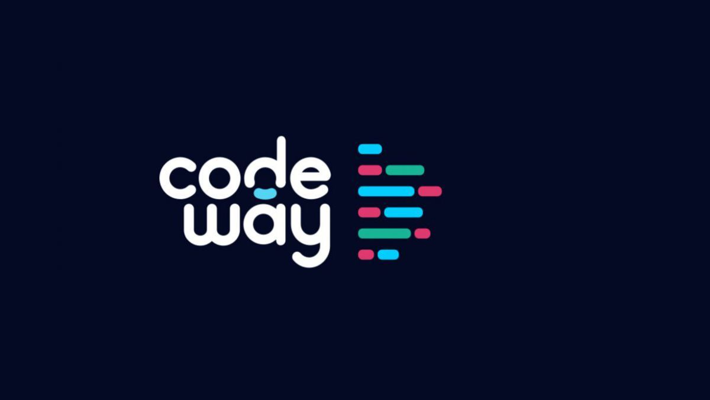

<div align="center">
  
</div>
<h1 align="center">
  <a href='https://resume.codeway.io/'>resume.codeway.io</a>
</h1>
<p align="center">Resume to go alongside my <a href='https://codeway.io'>personal website</a>.</p>

<h2 align="center">
  
  <br>
</h2>

## ⭐ Features
- Single page app to display the resume
- Pdf version obtainable by printing
- Easily updatable 

## Getting started

### Requirements
To try the website on your own machine you will need both [Git](https://git-scm.com) and [Node.js](https://nodejs.org/en/download/).

### Setup

In a terminal :
```bash

# Clone the repository
$ git clone https://github.com/codeway-0841/my-resume.git
$ cd resume

# Install the dependencies
$ npm install

# Launch the development server
$ npm start
```

From there the website should be accessible through http://localhost:3000/.

### Edition

Should one want to modify the data and colors of the website : 
- colors are in `src/app.scss`
- data for the different sections are stored in separate objects in `src/data.js`

